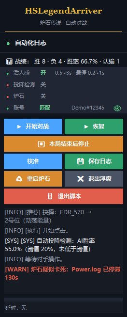

<div align="center">

# 🏆 HSLegendArriver（胜率 63.8 的炉石传说脚本）

### 帮你走完上传说的路

**读取炉石日志 + 获取炉石盒子打法建议 + 自动执行操作**

**33 分钟：钻石 2 → 传说** ｜ **一下午：冲到传说约 6000 名**

> 🔥 已实测支持：**机械骑 / 号角骑 / 弃牌术 / 海盗瞎**
> 🩺 无人值守安全：炉石闪退 / 卡死会醒目告警并**自动停止**，不会对着失效画面空转到天亮
> 🧪 第一次启动就自检：Python 版本、依赖、管理员权限、分辨率逐项 ✅/❌
> 🌿 **抉择 / 发现两步牌**：选完选项自动接着点目标（暮光侵扰、凶险梦魇、调酒师鲍勃「招募随从」）
> 🔍 **卡死可追**：识别失败时日志会打出推荐原文与 OCR 原文，不用再靠猜


</div>

> 网页控制台（界面示意，你机器上的数值会不同）：顶部是运行概览与环境自检，往下依次是基础配置、定时任务、对战控制、存活检测、自动投降、上分停止、活人感、延时设置、校准区域、实时日志。
>
> 📝 **更新日志**：[CHANGELOG.md](CHANGELOG.md)（最近一次 2026-10-08：浮窗重开修复、日志体积与一键清理、校准卡片重排）。

---

## ⚠️ 先看三条（最容易翻车的配置）

| # | 要求 | 不满足会怎样 |
| --- | --- | --- |
| 1 | **Python 必须 3.12（64 位）** | 装成 3.13/3.14 时，脚本能点「开始游戏」，但一进对局就卡在换牌、AI 识别全不工作（paddlepaddle 没有 3.13+ 的轮子） |
| 2 | **桌面 / 炉石 1920×1080、Windows 缩放 100%** | 所有点击坐标是硬编码的，缩放不是 100% 会整体偏移、点空 |
| 3 | 炉石用 **全屏**（`设置 → 选项 → 显示 → 显示模式 = 全屏`），**不要用「最大化窗口」** | 最大化窗口时客户区与 1920×1080 不一致，同上面一样整体点偏 |

> 还有一条：项目路径**不要有中文字符**（OCR 与依赖对中文路径支持不好）。

---

## 🚀 安装（4 步）

### 1. 装 Python 3.12
到 <https://www.python.org/downloads/> 下载 **Python 3.12**，安装时**务必勾选 `Add python.exe to PATH`**。
装完在 PowerShell 里 `python --version` 确认是 3.12。

### 2. 装依赖（清华镜像）
在项目根目录右键打开 PowerShell：

```powershell
pip install -r requirements.txt -i https://pypi.tuna.tsinghua.edu.cn/simple
```

依赖较大（含 PaddleOCR / PaddlePaddle），耐心等。

### 3. 以管理员身份启动
**必须用管理员 PowerShell**（否则鼠标点击会被系统拦掉，现象是「脚本在跑但点了没反应」）：

```powershell
cd 项目根目录
python web_ui.py
```

浏览器会自动打开 **`http://127.0.0.1:8765`**；端口被占用时会自动往后换（8765–8785），以控制台打印为准。

### 4. 打开炉石 + 炉石盒子
盒子用**简体中文**，左侧「推荐打法」面板要完整显示、不被别的窗口遮挡。

---

## 🎮 使用（5 步）

### 1. 填账号与日志目录
网页「👤 基础配置」里两项都不能少：

| 项 | 填什么 |
| --- | --- |
| 用户 ID | **当前账号完整的战网昵称，含 `#编号`**（换账号一定要同步改）。填错或不填 → 脚本读不出「我是谁」，整局不出牌 |
| 炉石日志目录 | 炉石安装目录下的 `Logs` 文件夹，例如 `D:\Hearthstone\Logs`。点旁边的 [检测] 可以验证 |

### 2. 校准盒子面板（只需一次）
点「🎯 校准区域」卡片里的 **[📐 打开校准窗口（屏幕上）]**，把**绿框**拖到盒子「打法参考A」面板上，看到提示条变成绿色「已检测到盒子面板」即可，按 **S**（或点卡片底部的 **「保存全部区域」**）保存，四个区域一起存；点 **「退出」** 或按 **Esc** 关掉窗口。

### 3. 看「🧪 环境自检」
页面顶部那张卡片每项一行：✅ 达标、⚠️ 和推荐值不同（还能跑）、❌ 不满足（**必须先修**）。缺依赖会直接给 pip 命令。

### 4. 开始运行（准备）
点 **[🪄 开始运行（准备）]**：只打开右上角日志浮窗 + 把炉石切到前台，**不会自动开打**。确认浮窗上「账号」显示**匹配**（不是匹配就先改用户 ID）。

### 5. 开始对战
点 **[⚔️ 开始对战]**（或浮窗上的 **[▶ 开始对战]**）：脚本开始按盒子推荐出牌。想停就点 **[立即停止]** 或按 **Ctrl+Q**。



> **右上角实时日志浮窗**（263×693，半透明置顶）：顶部是品牌与战绩，中间**五行状态**（活人感 / 投降检测 / 炉石 / 账号 / 日志，圆点绿=正常、红=关或异常、灰=未知、橙=要注意），下面 6 行按钮，最底部是延时进度条。状态行里名称和数值**挨着排**，说明文字放不下会**自动换行**，太长才以 `…` 结尾，不会被窗口边缘切掉。标题行右侧有个小小的 **「最小化」** 按钮：点一下折叠成一条标题条（再点「展开」还原），适合开直播/录屏时让出画面。浮窗**只移动鼠标、不点击**，不会干扰出牌。
>
> 图为旧版截图（那时还有副标题、按钮还带图标）；实际界面以当前版本为准。按钮/战绩/延时行都是**纯文字**：`▶ ⏹ ⏸ 💾 ♻ 🚪 📊` 这些字形在微软雅黑里没有，实机会画成方框。

### 浮窗上的按钮

| 按钮 | 作用 |
| --- | --- |
| 开始对战 / 中止（恢复） | 开始 / 暂停自动化 |
| 本局结束后停止 | 打完当前这局再停；再点一次取消 |
| 校准 / 保存日志 | 开/关屏幕上的校准窗口；另存一份对战日志到 `logs\` |
| 打开日志 / 清理日志 | Explorer 打开日志位置（选中最新一份对战日志）/ 一键清掉脚本日志（见下一节） |
| 重启炉石 | 会先弹确认：停自动化 → 结束 `Hearthstone.exe` → 清空日志目录（保留 `Log.config`）→ 重新拉起（战网点「开始游戏」前会先等 5 秒）。用于「日志状态和游戏对不上」 |
| 退出浮窗 | **只关这个窗口**，脚本继续跑。关掉后回到「未就绪」：网页大按钮变回「🪄 开始运行（准备）」，再点一次就把浮窗开回来（就算刚退出、浮窗还在收尾也能重开；真的开不出来时网页会提示并保持未就绪，不会假装已就绪） |
| 退出脚本 | 停自动化并结束整个进程 |
| 最小化 / 展开 | 折叠成标题条 / 还原（标题行右侧的小按钮；浮窗没有任务栏条目，所以不做系统最小化） |

### 📁 日志文件在哪、占多大、怎么清

浮窗状态面板最后一行就是**日志体积**：`日志  267.5 MB  194 个文件`（绿 <100 MB、橙 <500 MB、红 ≥500 MB）。它统计的是**脚本自己写出来的两类日志**：

| 文件 | 谁写的 | 说明 |
| --- | --- | --- |
| `logs\对战日志_<时间戳>.txt` | 浮窗「保存日志」 | 一份约 1 MB；攒久了会到几百 MB（本机实测 193 个 / 214 MB） |
| `ui_log_last.txt`（项目根） | 网页/自动化的运行日志 | 超过 2 MB 自动裁到最近 800 行（原子替换），正常不会再涨到几十 MB |

- **打开日志**：用 Explorer 打开 `logs\` 并选中最新一份对战日志（还没有保存过就只打开目录）；完整路径同时会写进网页日志。
- **清理日志**：先弹确认（写明要删多少份、共多大），确认后**后台线程**删除上面两类文件，汇报释放体积；正在被其它程序打开的文件会跳过并提示。不碰炉石自己的 `Logs` 目录（那是「重启炉石」的事），也不碰每次启动都会重写的 `log\sys_log.txt` 等分级日志。


---

## 🎯 校准截图区域

盒子面板的位置/大小随**盒子窗口大小、分辨率**变化，换了盒子窗口就重新校准一次。**三个入口打开的是同一个窗口**：

| 入口 | 怎么开 |
| --- | --- |
| 网页 | 「🎯 校准区域」→ [📐 打开校准窗口（屏幕上）] |
| 浮窗 | 点 **「校准」**（再点一次收起） |
| 命令行 | `python calibrate_roi.py` |

**四个可校准目标**（**Tab** 切换，或直接点目标条里的一行；**S** 保存、**Esc** 退出）：

| # | 框 | 写入 `ui_config.json` | 怎么对齐 |
| --- | --- | --- | --- |
| 1 | 🟩 绿框 | `recommendation_roi` | 框住盒子面板顶部「**打法参考A**」红头区域（OCR 就从这里读） |
| 2 | 🟦 蓝框 | `mulligan_confirm_roi` | 框住换牌界面的「确认」按钮（判断换牌提交成功没有） |
| 3 | 🟧 橙框 | `ai_win_rate_roi` | 框住左上角「AI胜率 X%」浮动条（自动投降用；读不到会自动放宽再读一次） |
| 4 | 🩵 青绿框 | `post_game_start_roi` | 框住每局结束底部的「开始」按钮——脚本**用框的正中心去点它** |

> 目标条里当前目标会高亮（左侧一条目标色竖条），说明文字在卡片内**自动换行**（冒号前的标题段金色高亮），不会穿出卡片；底部两个按钮 **「保存全部区域 (S)」** 和 **「退出 (Esc)」** 都能用鼠标点，悬停会提亮（背景透明的部分仍然鼠标穿透）。

> 屏幕上还会画出**只读**的参考框：🟥 红细框（AI胜率兜底区域）、🟪 紫框（段位数字：**有数字=已上传说，数字就是名次**）、✛ 黄十字（阶段判定点）。**框以外的画面鼠标穿透**，可以边看游戏边调。


> 图为示意图（假画面 + 真实叠加层）。程序固定 **1920×1080、缩放 100%**；只跑命令行时：
> `python calibrate_roi.py --no-ocr`（不加载 OCR 纯拖框）、`--selftest`（开窗 1 秒自检）、`--target win_rate`（直接选中 AI胜率）。

---

## 🩺 常见问题排查

| 现象 | 原因 / 处理 |
| --- | --- |
| 脚本在跑，但**点了没反应** | 没用管理员权限启动 Python。重开一个**管理员** PowerShell 再 `python web_ui.py` |
| 进对局后**卡在换牌**、AI 识别不工作 | Python 不是 3.12（多半装成了 3.13/3.14）。看「🧪 环境自检」第一项 |
| 点击**整体偏掉**、老是点空 | 分辨率不是 1920×1080，或缩放不是 100%，或炉石用了「最大化窗口」 |
| 浮窗一直刷「**当前推荐暂不可执行，继续重试：…**」 | 属于识别失败后重试。**把 `[推荐]` 那几行连同 `[推荐] 原文：` 一起贴出来**——原文是 OCR 读到的盒子面板内容，能直接看出是读错了面板还是遇上了没覆盖的写法 |
| 浮窗显示的状态和游戏**对不上**（明明没在游戏却显示在换牌） | 上一局残留的 `Power.log`。点浮窗 **♻ 重启炉石**，清空日志后重新「开始对战」 |
| 「账号」显示**不匹配** | 用户 ID 没写全（必须是含 `#编号` 的完整战网昵称）。浮窗「账号」行右侧的 **👁** 可以隐藏昵称（适合截图/直播），设置会记住 |
| 换牌迟迟不提交 | 蓝框（换牌「确认」按钮）没校准准；重开校准窗口拖好再保存 |
| OCR 模型没下载 | 首次识别会自动下载，也可以在「🧪 环境自检」里看到 ⚠️ 提示 |

**三个只读排查脚本**（不联网、不点击）：

```powershell
python tools/list_hand_target_cards.py      # 哪些卡会让脚本去点自己手牌
python tools/list_choice_target_cards.py    # 哪些抉择牌是「选完选项还要选目标」
python tools/probe_rank.py                  # 段位区域读数探测
```

---

## 🃏 对局中会遇到的特殊牌

### 🚀 星舰发射
识别本地 `cards.json` 里所有带 `STARSHIP` 机制的卡（当前 8 张），支持「发射N号位星舰」（也兼容「操作N号位星舰」「发射我方N号位星舰」）。执行顺序：点场上星舰 → **等 0.8 秒**（组件面板要画完）→ 点面板里的「发射」按钮（坐标按客户区等比换算）。

> 盒子把发射写成「操作N号位随从攻击」且**没有目标行**时，只要那张卡是星舰就走发射；**带目标**的星舰攻击仍按普通攻击处理。

### 🃏 手牌目标（弃牌 / 选手牌）
有些战吼或地标会让你**点自己手牌里的一张牌**（弃掉、变形、洗回牌库、加成）。名单不写死，按卡牌描述从 `cards.json` 自动收录（当前 24 张，如魔眼秘术师、雷鸣流云、处理证据、纯净圣母）。

- 出牌：点手牌那张 → 放随从 → **等 0.9 秒** → 点手牌里的目标；地标：点地标 → 等 0.3 秒 → 点手牌；
- 卡面要求「一张**法术**牌 / **随从**牌…」时会校验类型，对不上就**拒绝重试**，不会点错牌；
- **残恶梦魇**这类「手牌或战场都能选」的卡：先比内容再比目标卡名，判不出就按场面走（不会卡住回合）。

> 只收「目标确实是自己手牌里指定的一张」的写法；随机取一张的、看对手手牌的、触发条件自己挑的都不收。

### 🌿 抉择 / 发现：选完选项再选目标
有些牌是**两步**的：先选一项，选完还要再点一个目标——`暮光侵扰` 选「操纵荆棘」→ 点一个攻击力 ≤3 的随从；`凶险梦魇` 选「动荡能量」→ 点一个**受伤的**随从；`调酒师鲍勃` 选「招募随从」→ 点一个**对方随从**。

脚本把它当成**一个完整手势**：`点选项 → 等一会儿 → 点目标 → 右键取消`。

| 项 | 说明 |
| --- | --- |
| 选项怎么认 | 按盒子的「选择卡牌 X」认（X 是选项名，OCR 差一两个字也能认出来）；实在认不出就**只出牌、不点选项**，绝不猜一个 |
| 目标从哪来 | **只信盒子给出的「目标是…」那一行**；盒子没给目标就绝不点目标 |
| 顺序 | 先点选项再点目标，中间等「抉择/发现选目标延时」（默认 0.3s，网页可调） |
| 单选项 | 只有一个选项时游戏自己结算，脚本不点 |

> 暂不支持：① **先选随从、再出发现菜单**的顺序反过来的牌；② 选了选项**又弹一个发现菜单**的（鲍勃第 3 项「刷新酒馆」）；③ 两个选项长得一样、无法区分的极少数卡（会退化成「只出牌、不点选项」）。遇到请带 `Power.log` 反馈。

### ⏪ 回溯 / 维持时间线
HSAng 判定上一手失误时左下弹「回溯／维持」，盒子有时**只写「选择我方1号位卡牌」**。脚本改为读 Power.log 里选项的真实卡牌 ID（`TIME_000tb`=回溯、`TIME_000ta`=维持），按日志顺序映射到按钮，不再假设「1号位必定维持」。点完会重新核对选项数量和卡牌 ID，变了或选择框已关就直接拒绝，不会重复点。

### 🃏 发现菜单（含 4 选项）
盒子写「选择我方N号位卡牌」或「选第N个选项」时，按日志里的选项数量走对应布局：1/2/3 选项是屏幕中间那一排，**4 选项**（如调酒师鲍勃的酒馆绝技）用另一套坐标。点之前会核对选项实体，位置变了就不点。

---

## ⏱️ 延时设置（网页「⏱️ 延时设置」卡片）

自动化**运行中不能改**，保存后下次开局/下回合生效（写进 `ui_config.json` 的 `delays` 段）。

| 字段 | 默认 | 作用 |
| --- | --- | --- |
| 换牌前等待（秒） | 20 | 进换牌阶段先等，给盒子面板就位 |
| 识别后缓冲（秒） | 1 | 换牌建议识别完成 → 真正点击之间 |
| 换牌重试间隔（秒） | 5 | 面板没就绪/推荐不可执行时的重试退避 |
| 每张开局卡延时（秒） | 3.5 | 第一回合按「开局生效的全局卡」张数追加 |
| 每回合前延时（秒） | 7 | 每个新回合开始等盒子更新推荐 |
| 操作后延时（秒） | 0.2 | 一次操作完成 → 下一轮 OCR |
| 抽牌额外延时（秒/张） | 1 | 回合内抽到牌时每张额外等；回合开始那 1 张常规抽牌不算 |
| 抉择/发现选目标延时（秒） | 0.3 | 点完选项 → 点它自带目标之间（0–5） |
| OCR 缩放 | 1.4 | 识别精度/速度平衡点 |

---

## 🎛️ 可选功能一览

| 卡片 | 默认 | 说明 |
| --- | --- | --- |
| 🩺 存活检测 | **开启** | 判断炉石进程是否还在（闪退/被关=立即停止）；对局中 Power.log 停滞 **120s 告警 / 300s 自动停止**，避免无人值守空转 |
| 🏳️ 自动投降 | 关闭 | 盒子「AI胜率」低于阈值（默认 10%）且连续 N 回合（默认 3）→ 自动认输进入下一局 |
| 🏁 上分停止条件 | 关闭 | 「上传说就停」或「上到传说某名次就停」。只看段位**数字**：读得到数字=已上传说。命中时**不打断正在进行的一局**，本局收尾后自动停止 |
| 🎭 活人感 | 关闭 | 操作后不再用固定延时，改成随机 0.5~3s（可调）并在手牌区随手悬停；对手出现新随从时也会移上去停一停。全程**只移动鼠标、绝不点击**。攻击与星舰发射不做活人感 |
| ⏰ 定时任务 | — | 设置开始/结束时间；到结束时间会**先等本局打完**再停 |

---

## 🛠️ 环境要求

| 项目 | 要求 |
| --- | --- |
| 操作系统 | Windows |
| Python | **3.12（64 位）**，自检会强制这一条 |
| 炉石传说 / 炉石盒子 | 已安装，盒子使用**简体中文** |
| 桌面 / 炉石分辨率 | **1920 × 1080** |
| Windows 缩放 | **100%** |
| 权限 | **管理员**运行 Python |
| 炉石显示模式 | **全屏**（不要「最大化窗口」） |

## ⚠️ 启动前检查

- [ ] 盒子推荐打法面板在屏幕左侧、完整可见、未被遮挡
- [ ] 桌面 / 炉石都是 1920×1080，缩放 100%，炉石为全屏
- [ ] 「用户 ID」是**含 `#编号` 的完整战网昵称**
- [ ] 「🧪 环境自检」没有 ❌
- [ ] 校准窗口里绿框套住了盒子面板（提示条变绿）
- [ ] 「🩺 存活检测」保持开启（默认开启）
- [ ] 用**管理员**权限启动 `python web_ui.py`

---

## 🤝 Contributing

遇到问题或想提建议，欢迎在 Issue 里附上：**问题现象 + 游戏界面截图 + 运行环境**；识别类问题请额外附上那一局的浮窗日志（含 `[推荐] 原文：` 那几行）或 `Power.log`。

## ⭐

如果你觉得这个项目有意思或帮到了你，欢迎点一个 **Star ⭐**，这对我真的很重要！

> **如果真的靠它上传说了，回来留个 Star 吧 😎**

---

## 🙏 致谢

本项目参考了以下开源项目：

- [Yiyuan-Dong/AutoHS](https://github.com/Yiyuan-Dong/AutoHS)
- [FallAbyss/AutoHS](https://github.com/FallAbyss/AutoHS)

## 交流方式


## ⚠️ Disclaimer

本项目仅用于 **技术研究与代码交流**。本团队声明反对长期滥用脚本的行为，严禁将此开源项目用于商业用途。

---

<div align="center">

### 🏆 HSLegendArriver

**让 AI 帮你走完最后一段上传说的路。**

<a href="https://www.star-history.com/?repos=magicstrangelzb%2Fhearthstonelegendarriver&type=date&legend=top-left">
 <picture>
   <source media="(prefers-color-scheme: dark)" srcset="https://api.star-history.com/chart?repos=magicstrangelzb/hearthstonelegendarriver&type=date&theme=dark&legend=top-left" />
   <source media="(prefers-color-scheme: light)" srcset="https://api.star-history.com/chart?repos=magicstrangelzb/hearthstonelegendarriver&type=date&theme=light&legend=top-left" />
   
 </picture>
</a>

## ⭐ Star 一下吧 ⭐

</div>
